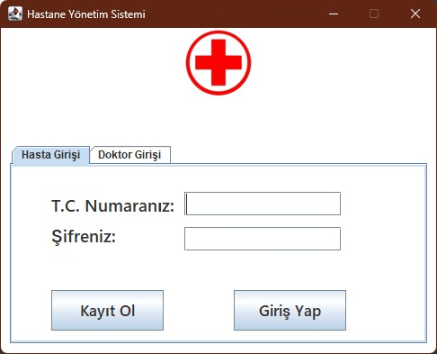
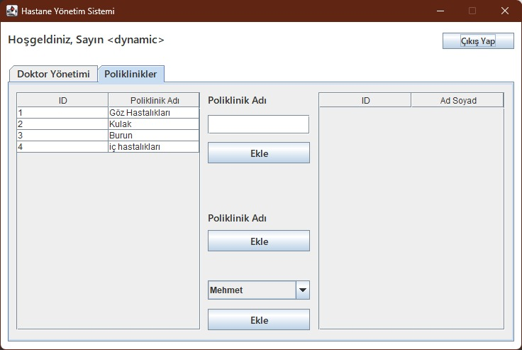
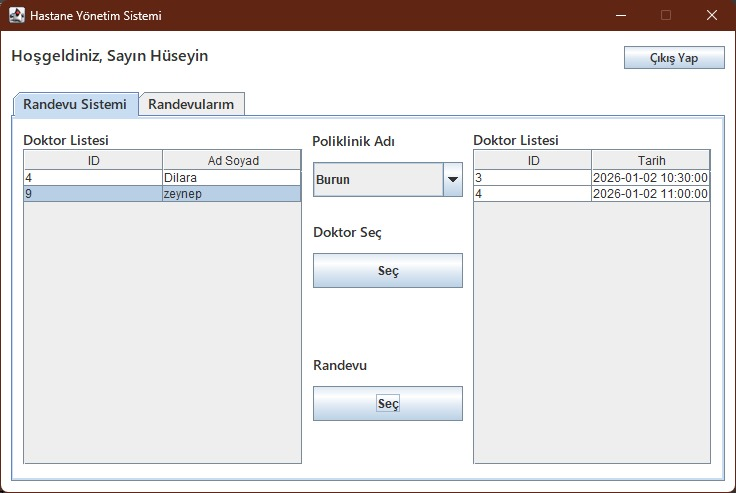
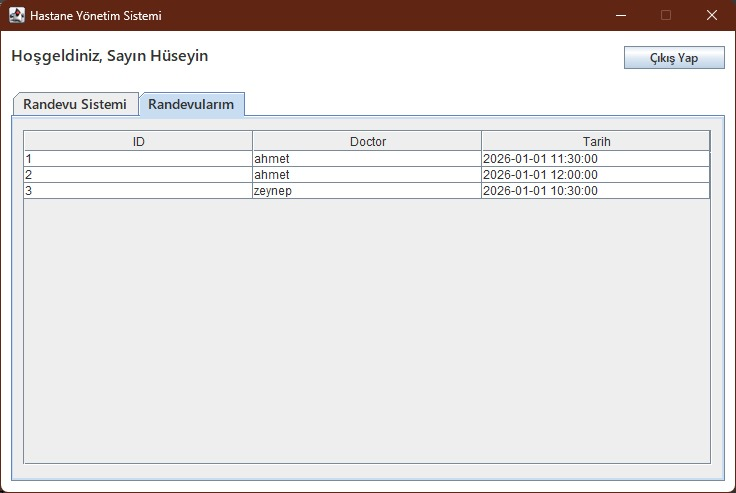

#  Hastane Yönetim Sistemi (Hospital Management System)

Bu proje, hastane randevu ve yönetim süreçlerini dijitalleştirmek amacıyla geliştirilmiş masaüstü tabanlı bir **Java Swing** uygulamasıdır. Başhekim, Doktor ve Hasta olmak üzere üç farklı kullanıcı rolü ile yetkilendirme yapılmıştır.

---

##  Özellikler

### 1.  Başhekim (Yönetici) Paneli
* **Doktor Yönetimi:** Sisteme yeni doktor ekleyebilir, TC Kimlik No ve şifre tanımlayabilir veya mevcut doktorları silebilir.
* **Poliklinik Yönetimi:** Hastaneye yeni poliklinikler ekleyebilir ve yönetebilir.
* **Dinamik Yapı:** Eklenen doktorlar ve poliklinikler veritabanına anlık olarak işlenir.

### 2.  Doktor Paneli
* **Giriş:** Kendisine tanımlanan bilgilerle sisteme giriş yapar.
* **Çalışma Saati Belirleme:** Doktorlar, hastaların randevu alabilmesi için kendi müsaitlik saatlerini takvime ekleyebilir.

### 3.  Hasta Paneli
* **Kayıt ve Giriş:** Hastalar sisteme kayıt olabilir ve giriş yapabilir.
* **Randevu Alma:** İstenilen poliklinik ve doktoru seçerek, doktorun belirlediği uygun saatlerden randevu oluşturabilir.
* **Randevu Takibi:** "Randevularım" sekmesinden alınan randevuları görüntüleyebilir.

---

##  Ekran Görüntüleri

### 1. Giriş ve Kayıt Ekranları
Uygulama açılışında kullanıcı türüne göre (Hasta/Doktor) giriş yapılır. Kayıt olmayan hastalar kayıt formunu kullanabilir.

| Giriş Ekranı | Hasta Kayıt |
| :---: | :---: |
|  |  |

### 2. Başhekim Yönetim Paneli
Başhekim, doktorları ve poliklinikleri bu arayüzden yönetir.

| Doktor Ekleme/Silme | Poliklinik Yönetimi |
| :---: | :---: |
|  |  |

### 3. Doktor İşlemleri
Doktorlar randevu saatlerini buradan ayarlar.

### 4. Hasta Randevu İşlemleri
Hastalar poliklinik/doktor seçip randevu alır ve listeler.

| Randevu Alma | Randevularım |
| :---: | :---: |
|  |  |

---

##  Veritabanı Yapısı

Proje `hospital` veritabanı altında ilişkisel tablolarla çalışır (`user`, `clinic`, `whour`, `appointment` vb.).

