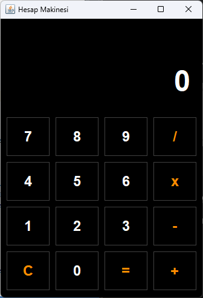
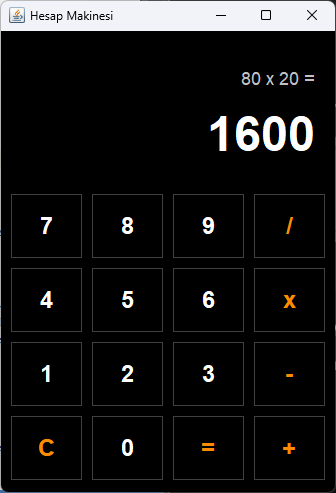

#  Hesap Makinesi (Calculator)

Bu proje, **Java Swing** kütüphanesi kullanılarak geliştirilmiş, modern arayüze sahip bir hesap makinesi uygulamasıdır. Standart hesaplama işlemlerinin yanı sıra, kullanıcı deneyimini iyileştiren "İşlem Geçmişi" özelliğini barındırır.

##  Ekran Görüntüleri

  
  &nbsp; &nbsp; &nbsp; &nbsp; 

##  Özellikler

* **İşlem Geçmişi (History Panel):** Yapılan işlemi ve önceki sayıları ekranın üst kısmında gösterir (Örn: `15 + 20 =`).

