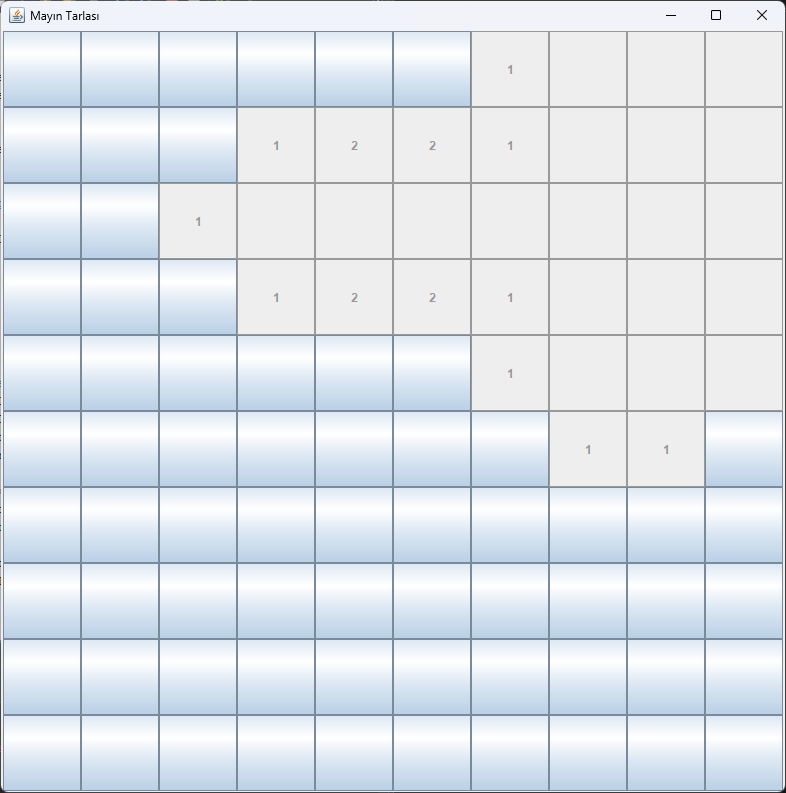
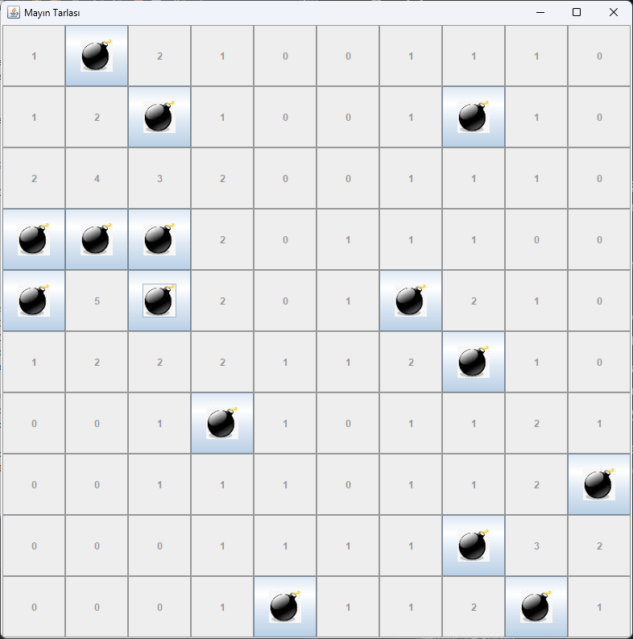

#  Mayın Tarlası (Minesweeper) - Java Swing

Bu proje,  **Mayın Tarlası** oyununun Java ve Swing kütüphanesi kullanılarak geliştirilmiş modern bir kopyasıdır. Nesne Yönelimli Programlama (OOP) prensiplerine sadık kalınarak, temiz ve modüler bir yapıda tasarlanmıştır.

##  Ekran Görüntüleri

##  Özellikler

* **Rastgele Mayın Üretimi:** Her yeni oyunda mayınlar rastgele konumlara yerleştirilir.
* **Özyinelemeli (Recursive) Açılma:** Boş bir kareye tıklandığında, çevresindeki güvenli alanlar otomatik olarak açılır.
* **Bayrak Dikme:** Mayın olduğundan şüphelendiğiniz yerlere **Sağ Tık** ile bayrak (🚩) koyabilirsiniz.
* **Dinamik Oyun Takibi:** Kalan mayın sayısını veya oyun durumunu (Kazandın/Kaybettin) takip eder.

